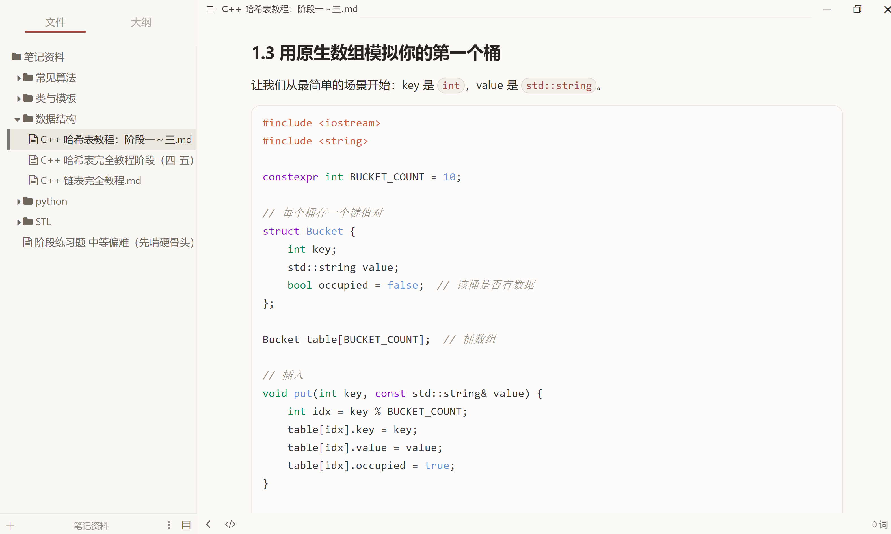

# Typora Claude Theme

这是一个受 Claude Web（网页端）白天模式启发的 Typora 主题。它采用了柔和的暖光背景、精致的排版以及极简的现代设计，旨在为你提供沉浸且无干扰的专注写作体验。

## ✨ 特性 (Features)

- **护眼暖色调**：以柔和的米黄色（`#faf9f5`）为主背景，大幅减轻长时间写作和阅读带来的视觉疲劳。
- **沉浸式极简设计**：去除繁冗的边框和阴影，还原界面的纯净感与呼吸感。
- **精致的代码排版**：对代码块（Code Fences）与行内代码进行了精细定制，使用了专属的代码背景色与圆角设计，语法高亮柔和清晰。
- **优化的阅读体验**：精心调整了各级标题大小、段落间距和行高；列表、引用块（Blockquote）和表格呈现克制且优雅的视觉层次。
- **浑然一体的侧边栏**：文件树和大纲侧边栏无缝融入主界面，通过柔和的背景色和指示条，提供极佳的交互视觉反馈。

## 📦 安装说明 (Installation)

1. 打开 Typora。
2. 进入偏好设置：
   - **Windows / Linux**: 点击菜单栏 `文件` -> `偏好设置` -> `外观` -> 点击 **`打开主题文件夹`**。
   - **macOS**: 点击菜单栏 `Typora` -> `偏好设置` -> `外观` -> 点击 **`打开主题文件夹`**。
3. 将包含主题的 [claude.css](claude.css) 文件（如果后续有字体和相关资源文件夹，也一并放入）复制到刚才打开的主题文件夹中。
4.关闭并重新启动 Typora。
5. 在 Typora 菜单栏的 **`主题 (Themes)`** 中选择 **`Claude`** 即可应用。

## 🎨 界⾯预览 (Screenshots)



## 🛠 修改与定制 (Customization)

该主题遵循现代 CSS 规范，所有的核心颜色都被提取为 CSS 变量（Variables）。如果你希望微调主题色彩，可以直接用文本/代码编辑器打开 [claude.css](claude.css) 文件，在最顶部的 `:root` 模块中修改这些变量：

```css
:root {
    --bg-color: #faf9f5;              /* 主背景色 */
    --text-color: #2e2b27;            /* 正文常规文本颜色 */
    --heading-color: #282521;         /* 标题颜色 */
    --primary-color: #a3473d;         /* 主题强调色（如链接悬停、指示器）*/
    --code-bg-color: #fdfcfa;         /* 代码块背景色 */
    --side-bar-bg-color: #f9f8f4;     /* 侧边栏背景色 */
    /* ... 更多颜色配置详见源码 */
}
